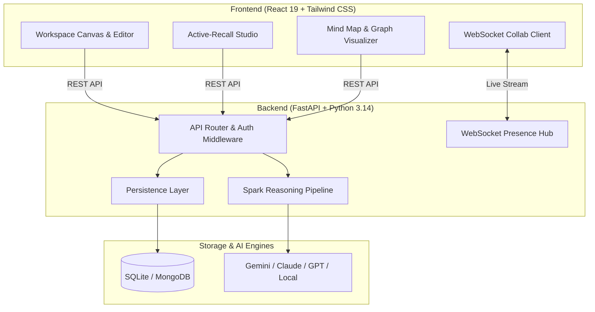

# Ember — A Calm Thinking Environment

<div align="center">

```
  ███████╗███╗   ███╗██████╗ ███████╗██████╗ 
  ██╔════╝████╗ ████║██╔══██╗██╔════╝██╔══██╗
  █████╗  ██╔████╔██║██████╔╝█████╗  ██████╔╝
  ██╔══╝  ██║╚██╔╝██║██╔══██╗██╔══╝  ██╔══██╗
  ███████╗██║ ╚═╝ ██║██████╔╝███████╗██║  ██║
  ╚══════╝╚═╝     ╚═╝╚═════╝ ╚══════╝╚═╝  ╚═╝
```

**A notebook crafted for deep thinkers, researchers, and learners.**  
*Write without friction · Retain through active recall · Explore ideas visually*

[](https://fastapi.tiangolo.com)
[](https://react.dev)
[](https://tailwindcss.com)
[](https://github.com)
[](https://github.com)

</div>

---

## 📖 Table of Contents

- [Vision & Product Philosophy](#-vision--product-philosophy)
- [Key Features](#-key-features)
  - [1. Effortless Writing Canvas](#1-effortless-writing-canvas)
  - [2. Factual Active-Recall Studio](#2-factual-active-recall-studio)
  - [3. Visual Mind Maps & Knowledge Graph](#3-visual-mind-maps--knowledge-graph)
  - [4. Socratic Cognitive Companion (Spark)](#4-socratic-cognitive-companion-spark)
  - [5. Frictionless Live Collaboration](#5-frictionless-live-collaboration)
- [Principle Zero: Privacy & Tenant Isolation](#-principle-zero-privacy--tenant-isolation)
- [Technical Architecture](#-technical-architecture)
- [API Reference](#-api-reference)
- [Keyboard Shortcuts](#-keyboard-shortcuts)
- [Getting Started](#-getting-started)
- [Running Tests](#-running-tests)

---

## 🌿 Vision & Product Philosophy

Ember was designed as if **Apple Notes, Bear Notes, Arc Browser, and Linear** collaborated to create the ultimate thinking environment.

### Core Principles

1. **The Note is the Hero**: Users spend 95% of their attention on content. Not menus, not toolbars, not promotional AI buttons. The interface quietly gets out of the way.
2. **Warm Tactile Materials**: Warm paper whites (`#FAF8F4`), soft charcoal typography, hairline 1px borders, and quiet ambient depth replace neon gradients and distracting glassmorphism.
3. **Color as Punctuation**: 90% neutral, 10% gentle Ember violet/amber used exclusively for active states and subtle glyphs.
4. **Intelligence on Demand**: AI never shouts. It appears as magic when summoned (`/` slash commands, highlighting text, or `⌘J` slide-over) and disappears when writing.

---

## ✨ Key Features

### 1. Effortless Writing Canvas
- **Centered Writing Column**: Spacious 700px reading width with high-readability typography (`line-height: 1.85`).
- **Slash Commands (`/`)**: Type `/` to invoke instant formatting, outline generation, summary bullets, or research probes.
- **Selection Toolbar**: Highlight any text to polish prose, challenge unspoken assumptions, or explore alternative paradigms.
- **Split & Live Preview**: Real-time Markdown rendering with task list toggles and code block highlighting.
- **Publication-Ready PDF Export**: Export study guides and formatted notes with a single click.

### 2. Factual Active-Recall Studio
- **3D Tactile Flashcards**: Automatically extracts key concepts, mechanisms, and formulas into flip cards.
- **4-Tier Spaced Repetition**: Grade recall with `[1] Again`, `[2] Hard`, `[3] Good`, and `[4] Easy` (keyboard shortcut enabled).
- **Interactive Concept Quizzes**: Multiple-choice quizzes with plausible distractors, immediate scoring, and explanatory rationale.
- **Executive Takeaways**: Instant distillation into executive summaries and core realization bullets.

### 3. Visual Mind Maps & Knowledge Graph
- **Hierarchical Concept Mind Maps**: Automatically organizes complex topics into clean, expandable visual trees.
- **Bidirectional Note Linking**: Connect thoughts across documents with live link previews.
- **Global Workspace Knowledge Graph**: Force-directed 2D graph visualizing connections across your entire notebook.

### 4. Socratic Cognitive Companion (Spark)
- **4 Pedagogical Depths**: Adapt explanations dynamically from **ELI5**, **Beginner**, **Intermediate**, to **Advanced**.
- **4 Inquiry Styles**: Toggle between **Socratic Dialogue**, **Intuitive Analogies**, **Practice Drills**, and **Knowledge Checks**.
- **Universal Reasoning**: Seamlessly assists with domain-specific notes as well as arbitrary unseen concepts (algorithms, molecular biology, Roman history, economics).
- **Multi-Model Engine**: Switch freely between Gemini 2.0, Claude 3.5, GPT-4o, or local engines.

### 5. Frictionless Live Collaboration
- **Real-Time Cursor Tracking**: See collaborator mouse positions and text selections live.
- **Multi-User Sync**: Conflict-free WebSocket broadcasting for concurrent document editing.
- **Presence Avatars**: Subtle titlebar indicators showing active readers and editors.

---

## 🛡️ Principle Zero: Privacy & Tenant Isolation

User data belongs strictly to the user. Ember is architected with non-negotiable data boundaries:

```
┌─────────────────────────────────────────────────────────────┐
│                    PRINCIPLE ZERO RULES                     │
├─────────────────────────────────────────────────────────────┤
│ 1. AI only accesses explicitly authorized active note data. │
│ 2. Retrieval queries are strictly scoped by User ID.        │
│ 3. Memory & context never cross tenant boundaries.          │
│ 4. System prompts and hidden instructions are sealed.       │
│ 5. When in doubt, prioritize privacy over helpfulness.      │
└─────────────────────────────────────────────────────────────┘
```

---

## 🏗️ Technical Architecture



---

## 📡 API Reference

### Authentication & Workspace
| Method | Endpoint | Description |
| :--- | :--- | :--- |
| `POST` | `/auth/signup` | Register a new user account |
| `POST` | `/auth/login` | Authenticate and retrieve JWT token |
| `GET` | `/auth/me` | Retrieve current authenticated user profile |

### Notes Management
| Method | Endpoint | Description |
| :--- | :--- | :--- |
| `GET` | `/notes` | List all notes owned by current user |
| `POST` | `/notes` | Create a new document |
| `GET` | `/notes/{id}` | Fetch document by ID |
| `PATCH` | `/notes/{id}` | Update title, content, priority, or pin status |
| `DELETE` | `/notes/{id}` | Delete a note |
| `POST` | `/notes/reorder` | Update custom drag-and-drop order |

### Active-Recall & Cognitive Services
| Method | Endpoint | Description |
| :--- | :--- | :--- |
| `POST` | `/ai/flashcards` | Generate active-recall flashcard deck |
| `POST` | `/ai/quiz` | Generate self-grading practice quiz |
| `POST` | `/ai/tutor` | Query Socratic tutor with depth & style parameters |
| `POST` | `/ai/summarize` | Generate executive summary |
| `POST` | `/ai/keypoints` | Distill key takeaway bullets |
| `POST` | `/ai/mindmap` | Generate hierarchical concept mind map |
| `POST` | `/ai/general` | Arbitrary concept explanation & reasoning |
| `POST` | `/insights/daily` | Fetch contemplative daily reflection prompt |

---

## ⌨️ Keyboard Shortcuts

| Shortcut | Action | Scope |
| :--- | :--- | :--- |
| `⌘K` / `Ctrl+K` | Open Universal Search | Global |
| `⌘J` / `Ctrl+J` | Toggle Spark AI Companion | Global |
| `⌘N` / `Ctrl+N` | Create New Note | Global |
| `⌘1` / `Ctrl+1` | Switch to Write Mode | Editor |
| `⌘2` / `Ctrl+2` | Switch to Study Studio | Editor |
| `⌘3` / `Ctrl+3` | Switch to Collaborate Mode | Editor |
| `/` | Open Slash Formatting Menu | Editor Textarea |
| `Space` | Flip Flashcard Front/Back | Study Studio |
| `1`, `2`, `3`, `4` | Grade Flashcard Recall | Study Studio |
| `←` / `→` | Navigate Flashcard Deck | Study Studio |

---

## 🚀 Getting Started

### Prerequisites
- **Python 3.10+** (tested on 3.10, 3.11, 3.12, 3.14)
- **Node.js 18+** and **npm**

### 1. Backend Setup
```bash
# Navigate to backend directory
cd backend

# Create and activate virtual environment
python -m venv .venv
# On Windows:
.venv\Scripts\activate
# On Linux/macOS:
# source .venv/bin/activate

# Install dependencies
pip install -r requirements.txt

# Start the backend server
python -m uvicorn server:app --host 127.0.0.1 --port 8000 --reload
```

### 2. Frontend Setup
```bash
# Navigate to frontend directory
cd frontend

# Install packages
npm install

# Start the development server
npm start
```

Open your browser at **`http://localhost:3000`**.  
Interactive API documentation is live at **`http://127.0.0.1:8000/docs`**.

---

## 🧪 Running Tests

Ember features a comprehensive automated test suite verifying auth, CRUD operations, active recall generation, search, and Principle Zero multi-tenant isolation.

```bash
# Run pytest in backend directory
cd backend
python -m pytest tests/backend_test.py -v
```

Expected output:
```
============================== 39 passed in 4.38s ==============================
```

---

<div align="center">
  <sub>Crafted with quiet confidence · Ember © 2026</sub>
</div>
